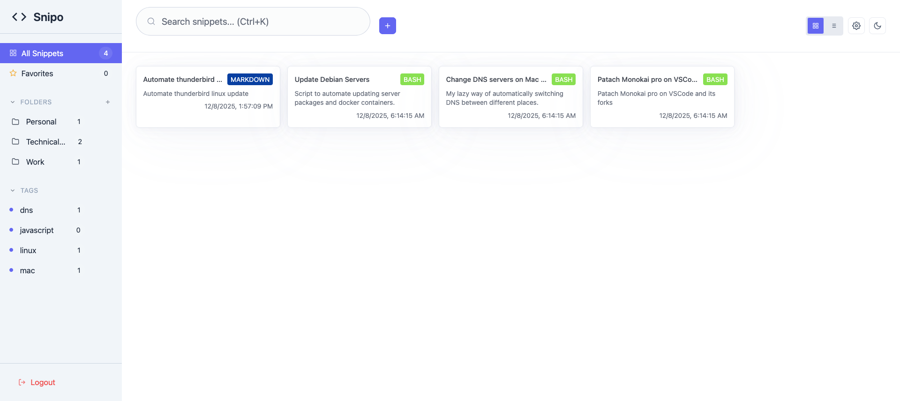

# Snipo

A lightweight, self-hosted snippet manager designed for single-user deployments.

> **Note:** This project is intentionally scoped for single-user use. Multi-user features are not planned.

[](https://github.com/MohamedElashri/snipo/actions/workflows/ci.yml)
[](https://github.com/MohamedElashri/snipo/actions/workflows/release.yml)
[](https://go.dev/)
[](https://www.gnu.org/licenses/gpl-3.0)
[](https://github.com/MohamedElashri/snipo/releases)

<p align="center">
  
</p>

## Quick Start

### Docker (Recommended)

```bash
# Create environment file
cat > .env << EOF
SNIPO_MASTER_PASSWORD=your-secure-password
SNIPO_SESSION_SECRET=$(openssl rand -hex 32)
EOF

# Run with Docker Compose
docker compose up -d
```

Access at http://localhost:8080

### Binary

```bash
# Download latest release
curl -LO https://github.com/MohamedElashri/snipo/releases/latest/download/snipo_linux_amd64.tar.gz
tar xzf snipo_linux_amd64.tar.gz

# Configure and run
export SNIPO_MASTER_PASSWORD="your-secure-password"
export SNIPO_SESSION_SECRET=$(openssl rand -hex 32)
./snipo serve
```

## Configuration

| Variable | Required | Default | Description |
|----------|----------|---------|-------------|
| `SNIPO_MASTER_PASSWORD` | Yes | - | Login password |
| `SNIPO_SESSION_SECRET` | Yes | - | Session signing key (32+ chars) |
| `SNIPO_PORT` | No | `8080` | Server port |
| `SNIPO_DB_PATH` | No | `./data/snipo.db` | SQLite database path |

See [`.env.example`](.env.example) for all available options including S3 backup configuration.

## API

Create API tokens in Settings → API Tokens. Authenticate via:
- `Authorization: Bearer <token>`
- `X-API-Key: <key>`

Full API documentation: [`docs/openapi.yaml`](docs/openapi.yaml)

## Development

See the [Development Guide](docs/Development.md) for build instructions, testing, and contribution guidelines.

## License

[GPLv3](LICENSE)
